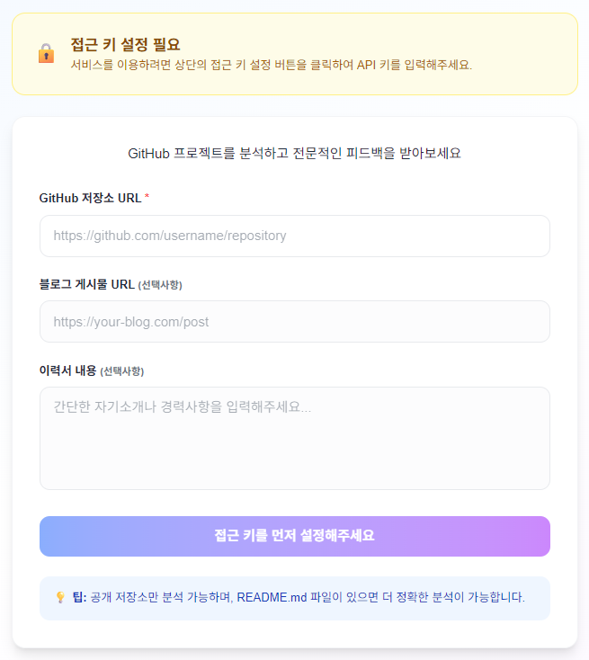
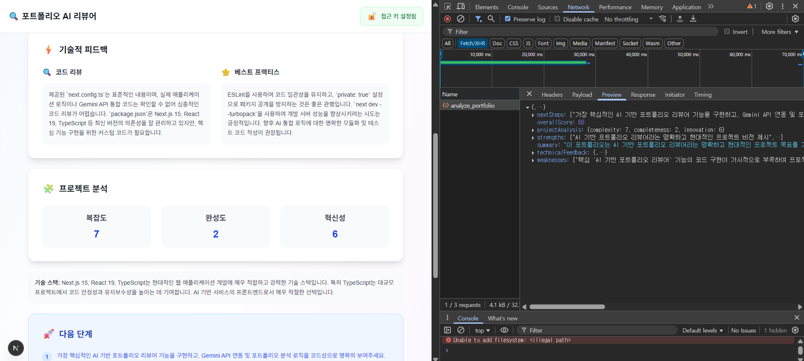

# MSA Portfolio Reviewer - ✨[바로가기](https://msa-portfoilo-reviewer-gemini.vercel.app)

## AI 기반 포트폴리오 종합 분석 서비스

## 🖼️ 메인화면 로고


## 🎇 분석 완료 화면 


## 📖 세부 분석 항목


## 소개
이 프로젝트는 사용자의 GitHub, 블로그, 이력서 정보를 바탕으로 AI가 포트폴리오를 종합적으로 분석해주는 웹 서비스입니다. 마이크로서비스 아키텍처(MSA) 환경에서 동작하며, 프론트엔드는 Next.js 기반으로 구현되어 있습니다.

## 주요 기능
- GitHub, 블로그, 이력서 텍스트 기반 포트폴리오 분석
- AI 기반 강점/약점, 기술적 피드백, 프로젝트 분석, 다음 단계 제안
- 외부 AI 분석 API(MSA)와 연동
- API Key 기반 인증

## 사용 기술
- **Next.js** 15
- **TypeScript**
- **React**
- **Tailwind CSS**
- **MSA 외부 API 연동**

## 폴더 구조
```
├── app/                # Next.js App Router
├── components/         # UI 컴포넌트
├── contexts/           # React Context
├── lib/                # API 클라이언트 등 라이브러리
├── types/              # 타입 정의
├── public/             # 정적 파일
├── docs/               # 문서
```

## 환경 변수
- `NEXT_PUBLIC_API_BASE_URL`: 외부 AI 분석 API 엔드포인트

## 실행 방법
```bash
pnpm install
pnpm dev
```

## API 연동
- `/gemini/analyze_portfolio` 엔드포인트로 포트폴리오 분석 요청
- 실제 응답 구조는 `types/portfolio.ts` 참고

## 기여
PR 및 이슈 환영합니다!

## 라이선스
MIT
